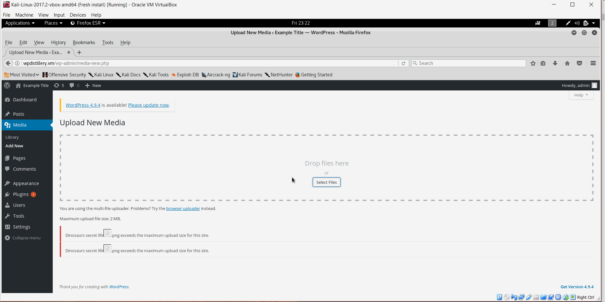
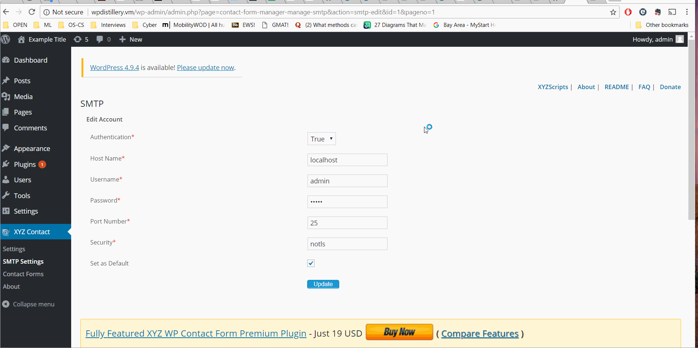

# Project 7 - WordPress Pentesting

> Objective: Find, analyze, recreate, and document **five vulnerabilities** affecting an old version of WordPress

## Pentesting Report

1. WP 4.2.3 Large File Upload XSS
  - [ ] Summary: In WordPress before 4.7.5, a cross-site scripting (XSS) vulnerability exists when attempting to upload very large files, because the error message does not properly restrict presentation of the filename.
    - Vulnerability types: CVE 2017-9061 
    - Tested in version: 4.2.3
    - Fixed in version: 4.7.5
  - [ ] GIF Walkthrough: 
  - [ ] Steps to recreate: 
    - Follow guide [here.](https://hackerone.com/reports/203515)
    - Created 20MB file: d if=/dev/zero of=file.txt count=1024 bs=20480
    - Renamed to include XSS: mv file.txt 'Dinosaurs secret life.png'
    - Uploaded file through admin console

2. CSRF on Contact Form Manager plugin
  - [ ] Summary: You can submit a POST request and utilize the Admin's authentication to change their SMTP settings. This is due to the lack of an anti-CSRF token.   
    - Vulnerability types: OVE-20160718-0003
    - Tested in version: 4.2.3
    - Fixed in version: No current fix.
  - [ ] GIF Walkthrough: 
  - [ ] Steps to recreate: 
    - Follow guide [here.](https://sumofpwn.nl/advisory/2016/cross_site_request_forgery___cross_site_scripting_in_contact_form_manager_wordpress_plugin.html)
    - [Install Contact Form Manager 1.4.6](https://wordpress.org/plugins/contact-form-manager/)
    - Host an external website with a malicious POST request: https://rcmccartney.github.io/
    - The authenticated Admin visits your website and your POST modifies their SMTP settings.

3. (Required) Vulnerability Name or ID
  - [ ] Summary: 
    - Vulnerability types:
    - Tested in version:
    - Fixed in version: 
  - [ ] GIF Walkthrough: 
  - [ ] Steps to recreate: 

4. (Optional) Vulnerability Name or ID
  - [ ] Summary: 
    - Vulnerability types:
    - Tested in version:
    - Fixed in version: 
  - [ ] GIF Walkthrough: 
  - [ ] Steps to recreate: 

5. (Optional) Vulnerability Name or ID
  - [ ] Summary: 
    - Vulnerability types:
    - Tested in version:
    - Fixed in version: 
  - [ ] GIF Walkthrough: 
  - [ ] Steps to recreate: 

## Assets

-Most assets are located in this repo.
-Malicious CSRF POST is located [here](https://github.com/rcmccartney/rcmccartney.github.io/blob/8518f720d2bc681143ae585269ec8136a0348073/index.html).

## Resources

- [WordPress Source Browser](https://core.trac.wordpress.org/browser/)
- [WordPress Developer Reference](https://developer.wordpress.org/reference/)

GIFs created with [LiceCap](http://www.cockos.com/licecap/).

## License

    Copyright [2018] [Rob]

    Licensed under the Apache License, Version 2.0 (the "License");
    you may not use this file except in compliance with the License.
    You may obtain a copy of the License at

        http://www.apache.org/licenses/LICENSE-2.0

    Unless required by applicable law or agreed to in writing, software
    distributed under the License is distributed on an "AS IS" BASIS,
    WITHOUT WARRANTIES OR CONDITIONS OF ANY KIND, either express or implied.
    See the License for the specific language governing permissions and
    limitations under the License.
